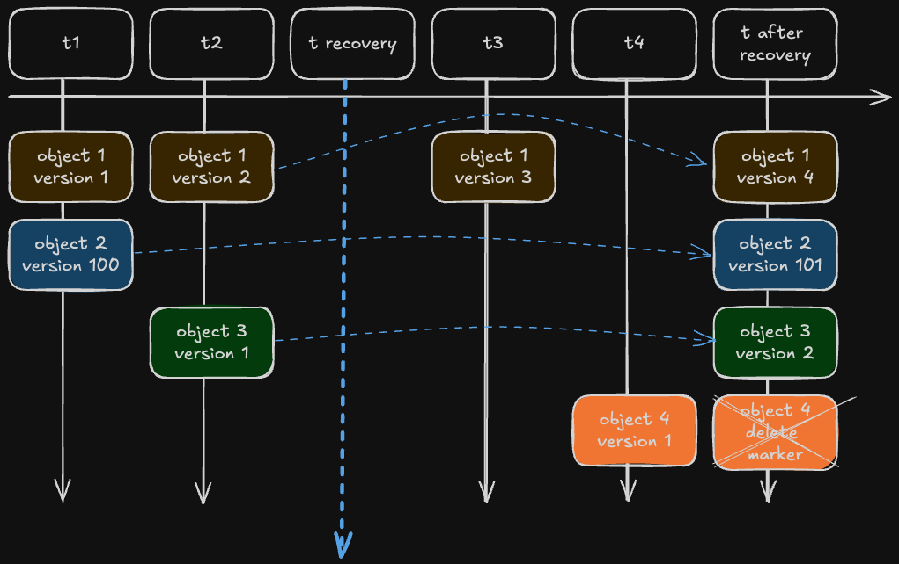

# Alibaba Cloud Object Storage Service (OSS) Point-in-Time Recovery Script

This script performs a point-in-time recovery for versioned buckets in Alibaba Cloud Object Storage Service (OSS). It allows you to recover objects in a specified folder to their state at a given time. It can also delete newer versions of objects if desired.

> [!NOTE]
> While this project is developed and maintained by an Alibaba Cloud employee, it is not an official Alibaba Cloud product or artifact. As such, it is not supported by Alibaba Cloud's official customer support channels. Users should use this script at their own discretion and risk. For any issues or concerns, please use the project's issue tracker rather than contacting Alibaba Cloud support.

## Prerequisites

- Python 3.6 or higher
- Alibaba Cloud OSS SDK for Python (`oss2`)
- Access to an Alibaba Cloud account with permissions to manage OSS buckets
- OSS Bucket with versioning enabled

## Installation

1. Clone the repository:

   ```sh
   git clone <repository-url>
   cd <repository-name>
   ```

2. Install the required Python packages:

   ```sh
   pip install -r requirements.txt
   ```

3. Run unit tests:

   ```sh
   python -m unittest discover tests
   ```

## Usage

The script supports the following arguments:

- `--access-key-id` (required): Your Alibaba Cloud Access Key ID.
- `--access-key-secret` (required): Your Alibaba Cloud Access Key Secret.
- `--endpoint` (required): Your OSS endpoint (e.g., `oss-eu-central-1.aliyuncs.com`). This is region-specific.
- `--bucket-name` (required): The name of the OSS bucket to operate on.
- `--folder-prefix` (required): The folder prefix to recover (e.g., `my-folder/`). Specifies the prefix for the folder that needs recovery.
- `--recovery-time` (required): The recovery time in UTC format (e.g., `2023-10-07T14:24:00Z`). All objects will be restored to their version as of this time.
- `--dry-run` (optional): If specified, the script will simulate actions without making any changes to the bucket.
- `--delete-newer-objects` (optional): If specified, the script will delete objects that have no versions older than the recovery timestamp.

### Example Command

```sh
python main.py \
    --access-key-id YOUR_ACCESS_KEY_ID \
    --access-key-secret YOUR_ACCESS_KEY_SECRET \
    --endpoint oss-region.aliyuncs.com \
    --bucket-name your-bucket-name \
    --folder-prefix my-folder/ \
    --recovery-time 2023-10-07T14:24:00Z \
    --dry-run \
    --delete-newer-objects
```

## Diagram of Recovery Functionality

The diagram illustrates how objects in the OSS bucket are handled during the recovery process:



1. **Timeline**: The timeline starts from earlier timestamps (e.g., `t1`, `t2`) to the recovery point (`t recovery`) and continues to later timestamps (`t3`, `t4`, etc.).
2. **Object Versions**: Each object (e.g., `Object 1`, `Object 2`, `Object 3`, etc.) has multiple versions that correspond to specific points in time.
3. **Recovery Actions**:
   - For objects with versions before the recovery point (`t recovery`), the script restores the **latest version** before `t recovery`. The restored object will have a new version.
   - For objects that only have versions **after** the recovery point (`t recovery`), the script puts a **delete marker** on those objects.


## Costs

Please be aware that executing this script will incur costs associated with Alibaba Cloud OSS usage, including:

- Storage costs for maintaining object versions
- API request costs for listing objects, retrieving object versions, and modifying object states

The exact costs will depend on your usage patterns, the amount of data processed, and your specific Alibaba Cloud pricing plan. It's recommended to review the official Alibaba Cloud OSS pricing documentation and estimate your costs before running this script at scale.

For the most up-to-date pricing information, please check the [official Alibaba Cloud OSS pricing page](https://www.alibabacloud.com/product/oss/pricing).

## FAQ

### What happens if the script is interrupted?

The script is designed to be idempotent - as it only adds delete markers and new versions, it can be interrupted and resumed without causing data loss.

### Can I recover objects that were deleted before the recovery point?

No, the script will not recover objects that were deleted before the recovery point. However, you can recover these objects using the OSS console or API.

## Contributing

We welcome contributions to Alibaba Cloud OSS Point-in-Time Recovery!

### ⭐ Star the Project
Show your support by starring the project on GitHub! It helps raise awareness and attract more contributors.

### Contribute
Please refer to the [CONTRIBUTING.md](CONTRIBUTING.md) file for detailed guidelines on how to contribute to this project, report issues, or suggest new features.

## License

This project is licensed under the Apache License 2.0. See the [LICENSE](LICENSE.txt) file for details.

